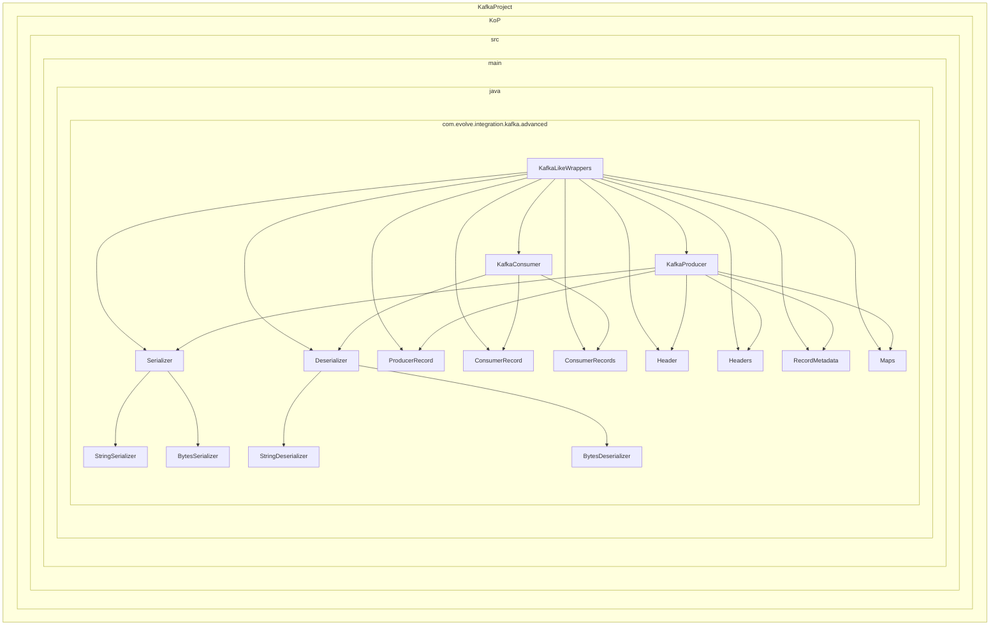

    

    <b>Automatic Architecture Diagrams from Code</b> 
    <a href="https://github.com/swark-io/swark">GitHub</a> • <a href="https://swark.io">Website</a> • <a href="mailto:contact@swark.io">Contact Us</a>

## Usage Instructions

1. **Render the Diagram**: Use the links below to open it in Mermaid Live Editor, or install the [Mermaid Support](https://marketplace.visualstudio.com/items?itemName=bierner.markdown-mermaid) extension.
2. **Recommended Model**: If available for you, use `claude-3.5-sonnet` [language model](vscode://settings/swark.languageModel). It can process more files and generates better diagrams.
3. **Iterate for Best Results**: Language models are non-deterministic. Generate the diagram multiple times and choose the best result.

## Generated Content
**Model**: GPT-4o - [Change Model](vscode://settings/swark.languageModel)  
**Mermaid Live Editor**: [View](https://mermaid.live/view#pako:eNqtVctuwjAQ_JXIZ8gH5NBDy6FSi4RKpV5y2doLMSR25Eckivj3GqIAbkLrmPqU7OzMesdreU-oZEgykou1grpI3me5SNzS9rMNvMBqCwslN0hNC_mwXFyiHqIV9REPrYCLPuylbKCB4RQvjcoqxUaWDaZcGHRBw6VIt8d9p8AaEBTZbZ3jOvX4yrf44RRrVDqZTh_OnTNLUUULPEmhbRUnsETFoeRfcewZ6rv4XetvSKWKcrDr_b8UdIzEMwKLM6BlRhVt9ztHAwwMxCjMoQ6p3B3S-HnxmKPP2mMHWzzAGt3kaGs9dqCt3dzFXCSPO_oK_ML-Y-OX02-HwSgu1qEj8YP8uDOoQ7nX_lyVDretJ3AqH8ZHccPVQaAX9ALnn9MHmRBnvXuomHsf9zkxBVaYkyzJCcMV2NLk5OCSbO0GEWcc3NNTkcwoixMC1sjlTtDuX0m7Lki2glLj4Rvg9_D3) | [Edit](https://mermaid.live/edit#pako:eNqtVctuwjAQ_JXIZ8gH5NBDy6FSi4RKpV5y2doLMSR25Eckivj3GqIAbkLrmPqU7OzMesdreU-oZEgykou1grpI3me5SNzS9rMNvMBqCwslN0hNC_mwXFyiHqIV9REPrYCLPuylbKCB4RQvjcoqxUaWDaZcGHRBw6VIt8d9p8AaEBTZbZ3jOvX4yrf44RRrVDqZTh_OnTNLUUULPEmhbRUnsETFoeRfcewZ6rv4XetvSKWKcrDr_b8UdIzEMwKLM6BlRhVt9ztHAwwMxCjMoQ6p3B3S-HnxmKPP2mMHWzzAGt3kaGs9dqCt3dzFXCSPO_oK_ML-Y-OX02-HwSgu1qEj8YP8uDOoQ7nX_lyVDretJ3AqH8ZHccPVQaAX9ALnn9MHmRBnvXuomHsf9zkxBVaYkyzJCcMV2NLk5OCSbO0GEWcc3NNTkcwoixMC1sjlTtDuX0m7Lki2glLj4Rvg9_D3)

